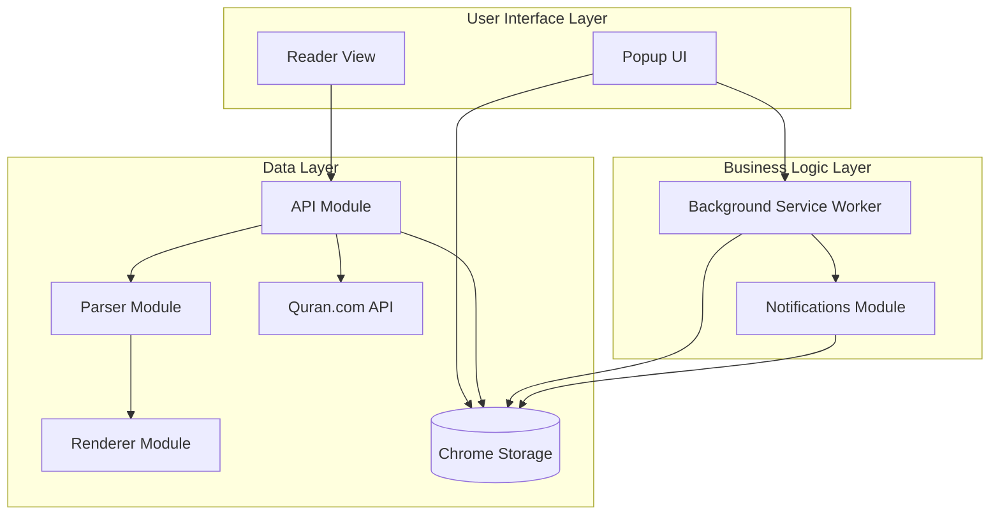

# Project Architecture & Structure

This document provides a comprehensive overview of the **Wird Reminder** Chrome Extension architecture, including detailed explanations of how each component interacts with others.

## High-Level Architecture

The extension is built using **Chrome Manifest V3** and follows a **layered, modular architecture** with clear separation of concerns:



---

## Core Components

### 1. Background Service Worker (`src/background/`)

The **backbone** of the extension. It runs independently of the UI and handles:

| File | Responsibility |
|------|----------------|
| `background.js` | Entry point, alarm listeners, notification click handlers, surah metadata initialization |
| `notifications.js` | Notification creation and formatting |

#### Key Interactions:

- **On Install**: Initializes `user_reminders` in storage and fetches all 114 surah names from Quran.com API, caching them in `surah_metadata`.
- **On Alarm Fire**: Listens to `chrome.alarms.onAlarm`, extracts the reminder ID, and calls `showNotification()`.
- **On Notification Click**: Opens the Reader view in a new tab with the reminder ID as a URL parameter.

```
┌─────────────────────────────────────────────────────────────┐
│                   Background Service Worker                   │
├─────────────────────────────────────────────────────────────┤
│  chrome.runtime.onInstalled → Initialize storage + cache     │
│  chrome.alarms.onAlarm → Trigger notification                │
│  chrome.notifications.onButtonClicked → Open Reader tab      │
└─────────────────────────────────────────────────────────────┘
```

---

### 2. Popup UI (`src/popup/`)

The **primary user interface**, displayed when clicking the extension icon. It provides:

| Feature | Description |
|---------|-------------|
| Reminder Management | View, add, edit, delete custom reminders |
| Preset Management | Enable/disable Sunnah preset reminders |
| Read Status Tracking | Mark reminders as read with frequency-based reset |
| Calendar View | Visual history of completed reads per reminder |
| Data Backup | Export/import functionality for data portability |

#### File Structure:

- `popup.html`: UI structure with tabs (Reminders, Add New, Settings), modals (delete, alert, calendar)
- `popup.js`: All popup logic (~1000 lines) including:
  - Tab navigation system
  - Form handling with validation
  - Alarm creation via `chrome.alarms.create()`
  - Storage CRUD operations
  - Calendar rendering with completion tracking

#### Key Interactions:

```
┌──────────────────────────────────────────────────────────────┐
│                        Popup UI                               │
├──────────────────────────────────────────────────────────────┤
│  ┌──────────┐    ┌──────────┐    ┌──────────┐                │
│  │ View Tab │    │ Add Tab  │    │ Settings │                │
│  └────┬─────┘    └────┬─────┘    └────┬─────┘                │
│       │               │               │                       │
│       ▼               ▼               ▼                       │
│  ┌─────────────────────────────────────────────────────────┐ │
│  │               chrome.storage.local                       │ │
│  │  ┌──────────────┐ ┌─────────────┐ ┌──────────────────┐  │ │
│  │  │user_reminders│ │read_history │ │    bookmarks     │  │ │
│  │  └──────────────┘ └─────────────┘ └──────────────────┘  │ │
│  └─────────────────────────────────────────────────────────┘ │
│       │               │                                       │
│       ▼               ▼                                       │
│  ┌─────────────┐  ┌─────────────┐                            │
│  │chrome.alarms│  │Reader View  │ (via chrome.tabs.create)   │
│  └─────────────┘  └─────────────┘                            │
└──────────────────────────────────────────────────────────────┘
```

---

### 3. Reader View (`src/reader/`)

A **dedicated, full-page reading experience** with a modular architecture:

```
┌─────────────────────────────────────────────────────────────┐
│                     Reader Architecture                       │
├─────────────────────────────────────────────────────────────┤
│                                                               │
│  ┌─────────────┐                                             │
│  │  reader.js  │  Coordinator Layer                          │
│  │ (Orchestrator)│  - Routes by reminder type                 │
│  └──────┬──────┘  - Manages read status & bookmarks          │
│         │                                                     │
│    ┌────┴────┬──────────┐                                    │
│    ▼         ▼          ▼                                    │
│ ┌──────┐ ┌────────┐ ┌──────────┐                            │
│ │api.js│ │parser.js│ │renderer.js│                          │
│ └──┬───┘ └───┬────┘ └────┬─────┘                            │
│    │         │           │                                   │
│    │ Data    │ Transform │ DOM                               │
│    │ Fetch   │ & Parse   │ Render                            │
│    ▼         ▼           ▼                                   │
│ Quran.com  Page Data   Mushaf-style                          │
│   API      Structures    HTML                                │
└─────────────────────────────────────────────────────────────┘
```

#### Module Breakdown:

| Module | Layer | Responsibility |
|--------|-------|----------------|
| `reader.js` | Coordinator | Orchestrates data flow, handles URL params, manages bookmarks and read status |
| `api.js` | Data | Fetches from Quran.com API, manages surah metadata cache |
| `parser.js` | Transform | Groups verses by page, parses lines, detects surah starts |
| `renderer.js` | Presentation | Pure DOM manipulation, creates mushaf-style page elements |

#### Data Flow:

1. **URL Parameter** → `reader.js` extracts `reminderId`
2. **Find Reminder** → Searches in `user_reminders` then `presets.json`
3. **Route by Type** → Calls appropriate render function (surah/ayah_range/juz)
4. **Fetch Data** → `api.js` fetches verses from Quran.com API
5. **Parse** → `parser.js` transforms into page/line structures
6. **Render** → `renderer.js` creates DOM elements
7. **Enhancements** → Bookmark handlers, mark-read buttons added

---

### 4. Storage System (`chrome.storage.local`)

All persistent data is stored using Chrome's local storage API:

```
chrome.storage.local
├── user_reminders[]     # Active reminders (custom + enabled presets)
├── read_history[]       # Log of read actions with timestamps
├── bookmarks{}          # Per-reminder bookmark positions
└── surah_metadata{}     # Cached surah ID → name mapping
```

#### Storage Schema Details:

**user_reminders** (Array):
```json
{
  "id": "custom_1703920000000",
  "name": "ورد الفجر",
  "type": "surah|ayah_range|juz",
  "target": { "surahId": 18, "startAyah": 1, "endAyah": 10 },
  "timing": { "frequency": "daily|weekly", "time": "05:00", "day": 5 },
  "enabled": true
}
```

**read_history** (Array, max 1000 entries):
```json
{
  "reminderId": "custom_1703920000000",
  "reminderName": "ورد الفجر",
  "timestamp": 1703930000000
}
```

**bookmarks** (Object, keyed by reminderId):
```json
{
  "custom_1703920000000": {
    "verseKey": "18:10",
    "wordPosition": "3",
    "timestamp": 1703940000000
  }
}
```

---

## Inter-Component Communication

### 1. Popup ↔ Storage ↔ Background

The popup and background don't communicate directly. They use **storage as a shared state**:

```
Popup                    Storage                   Background
  │                         │                          │
  ├──── set reminder ──────►│                          │
  │                         │◄──── observe changes ────┤
  │                         │                          │
  ├──── create alarm ───────┼──────────────────────────►
  │                         │                          │
```

### 2. Reader Load Sequence

```
┌────────────────────────────────────────────────────────────┐
│ 1. Notification clicked or "اقرأ" button pressed           │
│    └─► chrome.tabs.create (reader.html?reminderId=xxx)     │
├────────────────────────────────────────────────────────────┤
│ 2. reader.js → DOMContentLoaded                            │
│    └─► Extract reminderId from URL params                  │
├────────────────────────────────────────────────────────────┤
│ 3. findReminder(id)                                        │
│    ├─► Check chrome.storage.local (user_reminders)         │
│    └─► Fallback to src/data/presets.json                   │
├────────────────────────────────────────────────────────────┤
│ 4. renderByType(reminder, container)                       │
│    ├─► surah: fetchSurahVerses → parse → render            │
│    ├─► ayah_range: fetchAyahRange → parse → render         │
│    └─► juz: fetchJuzVerses → parse → render                │
├────────────────────────────────────────────────────────────┤
│ 5. Post-render enhancements                                │
│    ├─► renderMarkReadButtons (if enabled & has timing)     │
│    ├─► setupBookmarkHandlers                               │
│    └─► restoreBookmark (scroll to saved position)          │
└────────────────────────────────────────────────────────────┘
```

### 3. Alarm → Notification → Reader Flow

```
chrome.alarms.create()
       │
       ▼ (at scheduled time)
chrome.alarms.onAlarm
       │
       ▼
showNotification(reminderId)
       │
       ▼
chrome.notifications.create()
       │
       ▼ (user clicks "اقرأ الآن")
chrome.notifications.onButtonClicked
       │
       ▼
chrome.tabs.create(reader.html?reminderId=xxx)
```

---

## Directory Structure

```text
WirdReminder/
├── manifest.json              # Extension configuration (Manifest V3)
├── package.json               # Project metadata
├── documentation/             # Documentation files
│   ├── architecture.md        # This file
│   ├── api_reference.md       # API and storage schema details
│   └── maintenance.md         # Contribution guide
└── src/
    ├── assets/
    │   ├── fonts/             # UthmanicHafs, SurahNames fonts
    │   └── icons/             # Extension icons (16, 48, 128)
    ├── background/
    │   ├── background.js      # Service Worker entry point
    │   └── notifications.js   # Notification module
    ├── data/
    │   └── presets.json       # Predefined Sunnah reminders
    ├── popup/
    │   ├── popup.html         # Popup UI structure
    │   └── popup.js           # Popup logic (~1000 lines)
    ├── reader/
    │   ├── reader.html        # Reader page with embedded styles
    │   ├── reader.js          # Coordinator module
    │   ├── api.js             # Data fetching layer
    │   ├── parser.js          # Data transformation layer
    │   └── renderer.js        # DOM rendering layer
    └── styles/
        ├── base.css           # CSS variables, resets, Shadcn colors
        ├── components.css     # UI components (buttons, cards, modals)
        └── layout.css         # Layout utilities
```

---

## Design Principles

1. **Separation of Concerns**: Each module has a single responsibility
2. **Layered Architecture**: Clear boundaries between data, logic, and presentation
3. **Offline-First**: Surah metadata is cached on install for faster loads
4. **Modular CSS**: Design system with CSS variables for consistent styling
5. **Event-Driven**: Chrome APIs (alarms, notifications, storage) drive the app lifecycle
6. **RTL-First**: Arabic interface with proper right-to-left layout support
